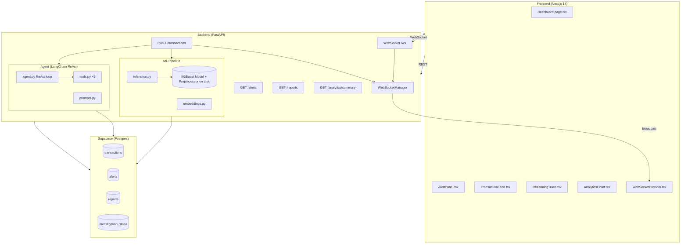
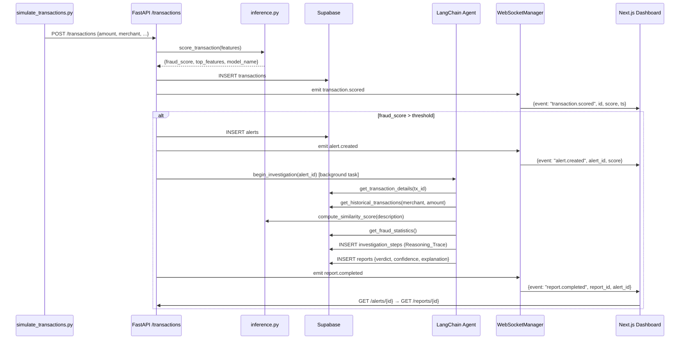

# Design Document: Agentic Fraud Detection System

## Overview

This system is a full-stack, agentic AI + ML fraud detection platform. It continuously scores incoming financial transactions using a trained ML model, autonomously investigates flagged transactions with a LangChain ReAct agent powered by Groq LLM, and surfaces live results on a React/Next.js dashboard via WebSocket.

The three-layer architecture mirrors production fraud systems at Stripe, Mastercard, and PayPal (Requirement 13.6):

1. **ML Scoring Layer** — scikit-learn + XGBoost pipeline returns a `Fraud_Score` (0.0–1.0) per transaction within 200ms (Requirement 2.1).
2. **Agentic Investigation Layer** — LangChain ReAct agent calls structured tools grounded in real DB data, building an auditable `Reasoning_Trace` and `Report` within 30 seconds (Requirement 3.5).
3. **Dashboard Layer** — Next.js 14 App Router frontend, updated in real time via FastAPI WebSockets (Requirement 6).

All components use free-tier or open-source services: Groq API, Supabase (hosted Postgres), HuggingFace sentence-transformers, scikit-learn, XGBoost, FastAPI, Next.js, and Tailwind CSS (Requirement 9.1).

### Tech Stack Justification Summary

Each technology choice is deliberate and documented in Requirement 12:

| Layer | Technology | Key Reason (Req 12.x) |
|---|---|---|
| LLM Inference | Groq API | 300–800 tok/s, free tier, no GPU needed (12.5) |
| Agent Framework | LangChain ReAct | Grounds answers in real data via tool calls (12.6) |
| Primary ML Model | XGBoost | Non-linear interactions, SHAP explainability, industry standard (12.1) |
| Ensemble Comparator | Random Forest | Bagging diversity, honest baseline comparator (12.2) |
| Interpretable Baseline | Logistic Regression | Log-odds interpretability, near-zero latency fallback (12.3) |
| Class Imbalance | SMOTE | Preserves both-class information without overfitting (12.4) |
| API Framework | FastAPI | Async-native, auto-OpenAPI, Pydantic validation (12.7) |
| Database | Supabase | Managed Postgres, free tier, no local install (12.8) |
| Embeddings | all-MiniLM-L6-v2 | 80MB, CPU-fast, free, no API key (12.9) |
| Frontend | Next.js 14 | SSR for fast initial load, file-based routing (12.10) |
| Styling | Tailwind CSS | Utility-first, zero runtime, sub-10KB output (12.11) |
| Real-time | WebSockets | Bidirectional, zero idle overhead vs polling (12.12) |

---

## Architecture

### High-Level Architecture Diagram



### Critical Path Data Flow

Transaction submitted → ML scored → Alert created → Agent investigates → Report stored → Dashboard updated



---

## Components and Interfaces

### File-by-File Description

Every file below contains a file-level docstring explaining its purpose, architecture role, and key design decisions (Requirement 10.1). Every function/class has a docstring with parameters, return values, and side effects (Requirement 10.2). Every non-obvious block has an inline comment explaining the why (Requirement 10.3). Every import statement is annotated with what the module provides and why it is used (Requirement 10.4).

#### Backend

| File | Description |
|---|---|
| `backend/main.py` | FastAPI app entry point — creates the app instance, registers routers, configures CORS, mounts WebSocket endpoint, and starts the ML model warm-up on startup |
| `backend/config.py` | Pydantic `BaseSettings` config — loads `GROQ_API_KEY`, `SUPABASE_URL`, `SUPABASE_ANON_KEY`, `FRAUD_THRESHOLD`, and `MODEL_PATH` from environment variables with validation |
| `backend/database.py` | Supabase client singleton — creates and exports the `supabase-py` client using `SUPABASE_URL` + `SUPABASE_ANON_KEY`; used by all routers and the agent for DB access |
| `backend/models/schemas.py` | Pydantic request/response schemas — `TransactionRequest`, `TransactionResponse`, `AlertResponse`, `ReportResponse`, and the consistent `APIEnvelope` wrapper `{"data": ..., "error": null}` |
| `backend/models/db_models.py` | TypedDict definitions matching each Supabase table's column layout — used for type-safe DB row manipulation without an ORM |
| `backend/ml/train.py` | ML training pipeline — loads fraud CSV, engineers features, handles class imbalance with SMOTE, trains Logistic Regression + Random Forest + XGBoost, evaluates with precision/recall/F1/AUC-ROC, serializes the best model |
| `backend/ml/inference.py` | Real-time scoring — loads the serialized model + preprocessor once at startup, exposes `score_transaction()` that returns `fraud_score`, `top_3_features`, and `model_name` within 200ms |
| `backend/ml/embeddings.py` | HuggingFace sentence-transformer wrapper — loads `all-MiniLM-L6-v2` locally, exposes `get_embedding(text)` for computing 384-dim vectors used by the agent's similarity tool |
| `backend/agent/agent.py` | LangChain ReAct agent — creates `AgentExecutor` with the 5 tools, Groq LLM, and system prompt; `run_investigation(alert_id)` drives the full loop and persists the `Reasoning_Trace` |
| `backend/agent/tools.py` | 5 LangChain `Tool` definitions — `get_transaction_details`, `get_historical_transactions`, `compute_similarity_score`, `get_fraud_statistics`, `flag_for_human_review` with DB-backed implementations |
| `backend/agent/prompts.py` | System and instruction prompts for the ReAct agent — encodes the investigation persona, output format for the Report, and chain-of-thought guidance |
| `backend/routers/transactions.py` | FastAPI router for `POST /transactions` and `GET /transactions` and `GET /transactions/{id}` — handles ML scoring, Alert creation, and background Agent dispatch |
| `backend/routers/alerts.py` | FastAPI router for `GET /alerts` and `GET /alerts/{id}` — pagination, status filtering, and full Report attachment |
| `backend/routers/reports.py` | FastAPI router for `GET /reports/{id}` — retrieves full Report including Reasoning_Trace JSON and investigation steps |
| `backend/routers/analytics.py` | FastAPI router for `GET /analytics/summary` — aggregates transaction counts, fraud rate, model accuracy, and alert resolution rate from Supabase |
| `backend/websocket_manager.py` | WebSocket connection manager — tracks active connections, broadcasts typed events (`transaction.scored`, `alert.created`, `report.completed`), manages heartbeat pings and stale connection cleanup |
| `backend/requirements.txt` | Pinned Python dependencies for reproducibility (Requirement 9.2) |
| `backend/.env.example` | All required environment variables with placeholder values and inline comments (Requirement 9.4) |

#### Frontend

| File | Description |
|---|---|
| `frontend/app/layout.tsx` | Root Next.js layout — wraps every page with `WebSocketProvider` context and global Tailwind base styles |
| `frontend/app/page.tsx` | Dashboard home — composes `TransactionFeed`, `AlertPanel`, and `AnalyticsChart` in a responsive grid layout |
| `frontend/app/alerts/[id]/page.tsx` | Alert detail page — fetches Alert + Report by ID, renders `ReasoningTrace` timeline and clarifying questions panel |
| `frontend/app/analytics/page.tsx` | Analytics page — fetches summary stats and renders `AnalyticsChart` with 7-day time-series data |
| `frontend/components/TransactionFeed.tsx` | Live transaction list — subscribes to `transaction.scored` WebSocket events, maintains a capped 50-item list with Fraud_Score badges and color-coded fraud status |
| `frontend/components/AlertPanel.tsx` | Alerts sidebar — subscribes to `alert.created` events, renders open Alerts sorted by Fraud_Score descending with severity color coding |
| `frontend/components/ReasoningTrace.tsx` | Agent reasoning timeline — renders each investigation step as a collapsible card showing tool name, inputs, outputs, and intermediate conclusion |
| `frontend/components/AnalyticsChart.tsx` | Recharts time-series chart — plots daily transaction volume vs fraud alert count over 7 days using Recharts `LineChart` |
| `frontend/components/WebSocketProvider.tsx` | React context provider — establishes the WebSocket connection to `/ws`, handles reconnection with exponential backoff, exposes event subscription via `useWebSocket()` hook |
| `frontend/lib/api.ts` | Type-safe API client — wraps `fetch` calls to all 7 REST endpoints with TypeScript interfaces matching `APIEnvelope` response shapes |
| `frontend/lib/supabase.ts` | Supabase JS client (frontend) — initialized with `NEXT_PUBLIC_SUPABASE_URL` and `NEXT_PUBLIC_SUPABASE_ANON_KEY` for optional direct Realtime subscriptions |
| `frontend/package.json` | Pinned JS dependencies (Requirement 9.3) |
| `frontend/.env.local.example` | Frontend environment variables with comments (Requirement 9.4) |

#### Scripts and Data

| File | Description |
|---|---|
| `scripts/simulate_transactions.py` | Demo data generator — generates synthetic transactions with configurable fraud rate, submits to API via REST, accepts `--count`, `--fraud-rate`, and `--rate` CLI arguments (Requirement 11) |
| `data/fraud_dataset.csv` | Pre-seeded synthetic fraud dataset of 1,000+ records for instant demo capability (Requirement 11.5) |
| `README.md` | Project overview, Mermaid architecture diagram, setup instructions, environment variable reference, and example API calls (Requirement 10.5) |

### Agent Components

#### ReAct Loop — Step by Step

The LangChain ReAct (Reasoning + Acting) loop grounds every conclusion in real data retrieved from the DB and ML pipeline (Requirement 3.2, 12.6):

```
1. TRIGGER
   Alert created → API router calls run_investigation(alert_id) as a FastAPI BackgroundTask

2. THOUGHT (LLM, Groq)
   Agent reads the system prompt + alert context and produces:
   "Thought: I need to retrieve the full transaction details first."

3. ACTION
   Agent emits: Action: get_transaction_details | Action Input: {"transaction_id": "..."}
   Tool is called, DB row is fetched.

4. OBSERVATION
   Tool returns: the transaction row as a JSON string.
   This is appended to the agent's scratchpad.

5. THOUGHT
   "Thought: Amount is $4,800 — above average. I need historical context."

6. ACTION → OBSERVATION (repeat for each tool call)
   Tools called in a typical investigation:
   a. get_transaction_details     → full transaction row
   b. get_historical_transactions → recent txns from same merchant/card
   c. compute_similarity_score    → top-3 semantically similar fraud cases
   d. get_fraud_statistics        → DB aggregates for reference
   e. flag_for_human_review       → (optional) if confidence is low

7. FINAL ANSWER
   LLM produces Final Answer in the structured Report format:
   verdict, confidence, explanation, recommended_actions, clarifying_questions

8. PERSIST
   Each THOUGHT/ACTION/OBSERVATION step → INSERT investigation_steps row
   Final Answer → INSERT reports row
   WebSocket: emit report.completed
```

---

## Data Models

### Supabase Schema — SQL

```sql
-- ============================================================
-- TABLE: transactions
-- Stores every submitted transaction with its ML scoring output.
-- Indexed for sub-100ms pagination on large datasets (Req 8.4).
-- ============================================================
CREATE TABLE transactions (
    id                  UUID PRIMARY KEY DEFAULT gen_random_uuid(),
    -- Raw input fields from the submitted transaction payload
    amount              NUMERIC(12, 2)   NOT NULL,
    currency            VARCHAR(3)       NOT NULL DEFAULT 'USD',
    merchant_name       TEXT             NOT NULL,
    merchant_category   VARCHAR(50)      NOT NULL,
    card_last_four      VARCHAR(4)       NOT NULL,
    cardholder_name     TEXT             NOT NULL,
    latitude            NUMERIC(9, 6),
    longitude           NUMERIC(9, 6),
    description         TEXT,
    -- ML inference output (Req 2.2)
    fraud_score         NUMERIC(5, 4),                    -- 0.0000–1.0000
    top_features        JSONB,                            -- [{"feature": "amount", "contribution": 0.42}, ...]
    model_name          VARCHAR(50),                      -- e.g. "xgboost_v1"
    -- Status flags
    is_fraud            BOOLEAN          NOT NULL DEFAULT FALSE,
    status              VARCHAR(20)      NOT NULL DEFAULT 'pending',  -- pending | scored | flagged | reviewed
    -- Timestamps (Req 8.1)
    submitted_at        TIMESTAMPTZ      NOT NULL DEFAULT NOW(),
    scored_at           TIMESTAMPTZ
);

-- Support fast pagination and filtering by date + fraud status (Req 8.4)
CREATE INDEX idx_transactions_submitted_at ON transactions(submitted_at DESC);
CREATE INDEX idx_transactions_fraud_score  ON transactions(fraud_score DESC);
CREATE INDEX idx_transactions_is_fraud     ON transactions(is_fraud);
CREATE INDEX idx_transactions_status       ON transactions(status);

-- ============================================================
-- TABLE: alerts
-- Created whenever a transaction's fraud_score exceeds the threshold.
-- Stores the threshold value at creation time for auditability (Req 8.2).
-- ============================================================
CREATE TABLE alerts (
    id                  UUID PRIMARY KEY DEFAULT gen_random_uuid(),
    transaction_id      UUID             NOT NULL REFERENCES transactions(id) ON DELETE CASCADE,
    -- Threshold captured at alert creation time so changes don't alter history (Req 8.2)
    threshold_at_creation  NUMERIC(5, 4) NOT NULL,
    fraud_score            NUMERIC(5, 4) NOT NULL,
    -- Lifecycle status: open → investigating → resolved | escalated
    status              VARCHAR(20)      NOT NULL DEFAULT 'open',
    -- Resolution metadata
    resolved_by         TEXT,
    resolution_notes    TEXT,
    created_at          TIMESTAMPTZ      NOT NULL DEFAULT NOW(),
    resolved_at         TIMESTAMPTZ
);

CREATE INDEX idx_alerts_transaction_id ON alerts(transaction_id);
CREATE INDEX idx_alerts_status         ON alerts(status);
CREATE INDEX idx_alerts_created_at     ON alerts(created_at DESC);
CREATE INDEX idx_alerts_fraud_score    ON alerts(fraud_score DESC);

-- ============================================================
-- TABLE: reports
-- One report per completed agent investigation (Req 3.4, 8.3).
-- reasoning_trace stored as JSONB array of step objects.
-- ============================================================
CREATE TABLE reports (
    id                  UUID PRIMARY KEY DEFAULT gen_random_uuid(),
    alert_id            UUID             NOT NULL REFERENCES alerts(id) ON DELETE CASCADE,
    -- Agent verdict output (Req 3.4)
    verdict             VARCHAR(20)      NOT NULL,  -- fraudulent | suspicious | legitimate
    confidence          VARCHAR(10)      NOT NULL,  -- high | medium | low
    explanation         TEXT             NOT NULL,  -- plain-English explanation
    recommended_actions JSONB,                      -- ["Block card", "Contact cardholder", ...]
    -- Clarifying questions for analyst review (Req 3.8)
    clarifying_questions JSONB,                     -- ["Is this merchant known to the cardholder?", ...]
    -- Full step-by-step chain of thought (Req 3.3)
    reasoning_trace     JSONB            NOT NULL DEFAULT '[]',
    -- Lifecycle
    status              VARCHAR(20)      NOT NULL DEFAULT 'pending',  -- pending | completed | failed
    error_message       TEXT,                       -- populated when status = 'failed' (Req 3.7)
    started_at          TIMESTAMPTZ      NOT NULL DEFAULT NOW(),
    completed_at        TIMESTAMPTZ
);

CREATE INDEX idx_reports_alert_id    ON reports(alert_id);
CREATE INDEX idx_reports_status      ON reports(status);
CREATE INDEX idx_reports_verdict     ON reports(verdict);

-- ============================================================
-- TABLE: investigation_steps
-- Each row is one THOUGHT/ACTION/OBSERVATION step from the ReAct loop.
-- Enables fine-grained step-level retrieval for the ReasoningTrace UI (Req 3.3).
-- ============================================================
CREATE TABLE investigation_steps (
    id                  UUID PRIMARY KEY DEFAULT gen_random_uuid(),
    report_id           UUID             NOT NULL REFERENCES reports(id) ON DELETE CASCADE,
    step_number         INTEGER          NOT NULL,  -- 1-based ordering
    step_type           VARCHAR(20)      NOT NULL,  -- thought | action | observation | final_answer
    -- Tool call fields (populated when step_type = 'action' | 'observation')
    tool_name           VARCHAR(50),                -- e.g. "get_transaction_details"
    tool_input          JSONB,                      -- raw input dict passed to the tool
    tool_output         JSONB,                      -- raw output returned by the tool
    -- Reasoning text (populated for thought | final_answer steps)
    content             TEXT,
    -- Error capture (Req 4.4)
    is_error            BOOLEAN          NOT NULL DEFAULT FALSE,
    error_detail        TEXT,
    created_at          TIMESTAMPTZ      NOT NULL DEFAULT NOW()
);

CREATE INDEX idx_investigation_steps_report_id ON investigation_steps(report_id);
CREATE INDEX idx_investigation_steps_step_number ON investigation_steps(report_id, step_number);
```

### Pydantic Schemas (schemas.py)

```python
# Request — submitted by simulation script or external caller
class TransactionRequest(BaseModel):
    amount: float                    # transaction value in currency units
    currency: str = "USD"            # ISO 4217 currency code
    merchant_name: str               # display name of the merchant
    merchant_category: str           # MCC category label
    card_last_four: str              # last 4 digits for identification
    cardholder_name: str
    latitude: float | None = None
    longitude: float | None = None
    description: str | None = None

# Response envelope — consistent across all endpoints (Req 5.3)
class APIEnvelope(BaseModel, Generic[T]):
    data: T | None
    error: ErrorDetail | None

class ErrorDetail(BaseModel):
    code: str
    message: str

# ML inference result
class ScoringResult(BaseModel):
    fraud_score: float               # 0.0–1.0
    top_features: list[FeatureContribution]
    model_name: str

class FeatureContribution(BaseModel):
    feature: str
    contribution: float

# Full transaction response
class TransactionResponse(BaseModel):
    id: str
    amount: float
    merchant_name: str
    merchant_category: str
    fraud_score: float | None
    is_fraud: bool
    status: str
    submitted_at: datetime
    alert: AlertSummary | None
    report: ReportSummary | None

# Alert response
class AlertResponse(BaseModel):
    id: str
    transaction_id: str
    fraud_score: float
    status: str
    created_at: datetime
    report: ReportResponse | None

# Report response — includes full reasoning trace
class ReportResponse(BaseModel):
    id: str
    alert_id: str
    verdict: str                     # fraudulent | suspicious | legitimate
    confidence: str                  # high | medium | low
    explanation: str
    recommended_actions: list[str]
    clarifying_questions: list[str]
    reasoning_trace: list[InvestigationStep]
    status: str
    completed_at: datetime | None

class InvestigationStep(BaseModel):
    step_number: int
    step_type: str                   # thought | action | observation | final_answer
    tool_name: str | None
    tool_input: dict | None
    tool_output: dict | None
    content: str | None
    is_error: bool
```

---

## API Contracts

All 7 REST endpoints exposed by the FastAPI backend (Requirement 5.1). Every response uses the `APIEnvelope` wrapper `{"data": ..., "error": null}` on success (Requirement 5.3). All request bodies are validated by Pydantic; invalid payloads return HTTP 422 with field-level errors (Requirement 5.2).

### POST /transactions

Submit a new transaction for ML scoring. Triggers the full pipeline (Req 2, 3).

**Request Body:** `TransactionRequest`
```json
{
  "amount": 4800.00,
  "currency": "USD",
  "merchant_name": "Electronics Plus",
  "merchant_category": "electronics",
  "card_last_four": "4242",
  "cardholder_name": "Jane Smith",
  "latitude": 37.7749,
  "longitude": -122.4194,
  "description": "Large electronics purchase"
}
```

**Response 200:** `APIEnvelope<TransactionResponse>`
```json
{
  "data": {
    "id": "uuid",
    "fraud_score": 0.87,
    "is_fraud": true,
    "status": "flagged",
    "top_features": [
      {"feature": "amount_zscore", "contribution": 0.42},
      {"feature": "hour_of_day", "contribution": 0.31},
      {"feature": "merchant_category_risk", "contribution": 0.18}
    ],
    "model_name": "xgboost_v1"
  },
  "error": null
}
```

**Response 422:** Missing/invalid fields with per-field detail.

### GET /transactions

List transactions with pagination and filtering (Req 5.1).

**Query Params:** `page` (int, default 1), `page_size` (int, default 20, max 100), `from_date` (ISO8601), `to_date` (ISO8601), `is_fraud` (bool)

**Response 200:** `APIEnvelope<PaginatedList<TransactionResponse>>`

### GET /transactions/{id}

Retrieve a single transaction with its Alert and Report (Req 5.1).

**Response 200:** `APIEnvelope<TransactionResponse>` — includes nested `alert` and `report` objects.
**Response 404:** `{"data": null, "error": {"code": "NOT_FOUND", "message": "Transaction not found"}}`

### GET /alerts

List alerts with pagination and status filtering (Req 5.1).

**Query Params:** `page`, `page_size`, `status` (open | investigating | resolved | escalated)

**Response 200:** `APIEnvelope<PaginatedList<AlertResponse>>`

### GET /alerts/{id}

Retrieve a single alert with its full Investigation Report (Req 5.1).

**Response 200:** `APIEnvelope<AlertResponse>` — includes nested `report` with `reasoning_trace`.
**Response 404:** standard error envelope.

### GET /reports/{id}

Retrieve the full Investigation Report including all `investigation_steps` (Req 5.1).

**Response 200:** `APIEnvelope<ReportResponse>`

### GET /analytics/summary

Return aggregate counts and rates for the dashboard analytics panel (Req 5.1, 7.4).

**Response 200:**
```json
{
  "data": {
    "total_transactions_today": 1240,
    "fraud_rate_today": 0.043,
    "total_alerts_open": 17,
    "alert_resolution_rate": 0.82,
    "model_accuracy": 0.964,
    "top_fraud_signal_categories": [
      {"category": "electronics", "count": 34},
      {"category": "travel", "count": 22}
    ],
    "daily_series": [
      {"date": "2025-01-10", "transactions": 980, "alerts": 43},
      ...
    ]
  },
  "error": null
}
```

---

## WebSocket Event Schema

The WebSocket endpoint at `/ws` broadcasts three event types (Requirement 6). The `WebSocketManager` maintains all active connections, sends heartbeat pings every 30 seconds, and closes stale connections that have not responded within 60 seconds (Req 6.5). If a client disconnects, its connection is cleanly removed without affecting others (Req 6.6).

### Event: `transaction.scored`

Emitted when a transaction is scored by the ML pipeline (Req 6.2).

```json
{
  "event": "transaction.scored",
  "payload": {
    "transaction_id": "uuid",
    "fraud_score": 0.23,
    "is_fraud": false,
    "merchant_name": "Coffee Shop",
    "amount": 12.50,
    "timestamp": "2025-01-15T10:23:45Z"
  }
}
```

### Event: `alert.created`

Emitted when a transaction's fraud score exceeds the threshold and an Alert is created (Req 6.3).

```json
{
  "event": "alert.created",
  "payload": {
    "alert_id": "uuid",
    "transaction_id": "uuid",
    "fraud_score": 0.87,
    "threshold": 0.70,
    "merchant_name": "Electronics Plus",
    "amount": 4800.00,
    "timestamp": "2025-01-15T10:23:50Z"
  }
}
```

### Event: `report.completed`

Emitted when the Agent finishes an investigation and the Report is stored (Req 6.4).

```json
{
  "event": "report.completed",
  "payload": {
    "report_id": "uuid",
    "alert_id": "uuid",
    "verdict": "fraudulent",
    "confidence": "high",
    "timestamp": "2025-01-15T10:24:12Z"
  }
}
```

---

## ML Pipeline Design

### Feature Engineering (Requirement 1.2)

The ML pipeline operates on a feature matrix derived from raw transaction fields. Features are computed in `train.py` during training and identically in `inference.py` at serving time (no train-serve skew).

**Numeric features (scaled with `StandardScaler`):**

| Feature | Description |
|---|---|
| `amount` | Raw transaction amount |
| `amount_zscore` | Z-score of amount vs cardholder's historical mean |
| `hour_of_day` | Hour extracted from transaction timestamp (0–23) |
| `day_of_week` | Day of week (0=Monday, 6=Sunday) |
| `days_since_last_txn` | Days since cardholder's previous transaction |
| `txn_velocity_1h` | Number of transactions from same card in past 1 hour |
| `txn_velocity_24h` | Number of transactions from same card in past 24 hours |
| `geo_distance_km` | Haversine distance from previous transaction location |
| `amount_vs_merchant_mean` | Ratio of amount to merchant's historical average ticket |

**Categorical features (encoded with `OrdinalEncoder` / `OneHotEncoder`):**

| Feature | Description |
|---|---|
| `merchant_category` | MCC label — electronics, travel, groceries, etc. |
| `currency` | ISO 4217 code |
| `is_international` | Derived boolean — different country from card home region |
| `card_present` | Boolean — CNP (card-not-present) is higher risk |

**SHAP Explainability** — after training, SHAP `TreeExplainer` computes feature contributions per prediction. The top-3 SHAP values are stored with each transaction row as `top_features` JSON (Req 2.2).

### Class Imbalance Handling (Requirement 1.2, 12.4)

SMOTE is applied to the training set only (never to validation/test sets to prevent data leakage). If SMOTE fails due to insufficient minority samples, class weights are used as a fallback — both strategies are tried in sequence.

```python
# Pipeline: impute → encode → scale → SMOTE → model
pipeline = Pipeline([
    ("imputer",   SimpleImputer(strategy="median")),
    ("encoder",   ColumnTransformer([
                      ("ohe", OneHotEncoder(), categorical_cols),
                      ("scl", StandardScaler(), numeric_cols)
                  ])),
])
X_resampled, y_resampled = SMOTE(random_state=42).fit_resample(X_train_transformed, y_train)
```

### Model Comparison Approach (Requirement 1.1, 1.3)

Three models are trained on the same train split and evaluated on the same held-out test set:

```
1. LogisticRegression(max_iter=1000, class_weight="balanced")
2. RandomForestClassifier(n_estimators=200, class_weight="balanced", random_state=42)
3. XGBClassifier(n_estimators=300, learning_rate=0.05, scale_pos_weight=<imbalance_ratio>)
```

All three are evaluated with:
- `precision_score`, `recall_score`, `f1_score` — at the configured `FRAUD_THRESHOLD`
- `roc_auc_score` — threshold-independent
- Training + inference time measured to flag latency regressions

The model with the highest `f1_score` is selected (balancing precision vs recall — both matter in fraud detection). The best model + its `ColumnTransformer` preprocessor are serialized together as a `sklearn.pipeline.Pipeline` to `MODEL_PATH` using `joblib.dump()` (Req 1.4).

### Training Log (Requirement 1.5)

All metrics, hyperparameters, and timestamps are written to `training_log.json`:

```json
{
  "timestamp": "2025-01-15T09:00:00Z",
  "dataset_path": "data/fraud_dataset.csv",
  "train_size": 800,
  "test_size": 200,
  "models": {
    "logistic_regression": {"precision": 0.71, "recall": 0.68, "f1": 0.69, "auc": 0.84},
    "random_forest":       {"precision": 0.88, "recall": 0.82, "f1": 0.85, "auc": 0.95},
    "xgboost":             {"precision": 0.92, "recall": 0.87, "f1": 0.89, "auc": 0.97}
  },
  "best_model": "xgboost",
  "model_path": "models/fraud_model.joblib"
}
```

### Model Loading at Startup (Requirement 2.4)

`inference.py` loads the serialized pipeline exactly once at FastAPI startup via `@app.on_event("startup")` — subsequent calls to `score_transaction()` reuse the already-loaded in-memory model. This ensures sub-200ms inference latency (Req 2.1) by eliminating per-request disk I/O.

---

## Agent Tool Signatures (Requirement 4.1)

All 5 tools are defined in `tools.py` as LangChain `Tool` objects with Pydantic `BaseModel` input schemas for type-safe argument parsing.

### Tool 1: `get_transaction_details`

```python
class GetTransactionDetailsInput(BaseModel):
    transaction_id: str  # UUID of the transaction to retrieve

def get_transaction_details(transaction_id: str) -> str:
    """
    Fetches the full transaction row from Supabase including amount, merchant,
    fraud_score, top_features, and timestamps. Returns a JSON string.
    Validates: Requirement 4.1
    """
```

### Tool 2: `get_historical_transactions`

```python
class GetHistoricalTransactionsInput(BaseModel):
    card_last_four: str       # card identifier
    merchant_category: str    # filter to same category
    days_back: int = 30       # lookback window
    limit: int = 10           # max rows returned

def get_historical_transactions(card_last_four, merchant_category, days_back, limit) -> str:
    """
    Queries Supabase for recent transactions on the same card in the same
    merchant category. Used by the agent to detect velocity anomalies and
    spending pattern deviations. Returns JSON array of transaction summaries.
    Validates: Requirement 3.6, 4.1
    """
```

### Tool 3: `compute_similarity_score`

```python
class ComputeSimilarityScoreInput(BaseModel):
    description: str    # transaction description text
    top_k: int = 3      # number of similar fraud cases to return

def compute_similarity_score(description: str, top_k: int) -> str:
    """
    Embeds the description with all-MiniLM-L6-v2, then computes cosine
    similarity against stored embeddings of confirmed-fraud transactions.
    Returns the top_k most similar fraud cases with similarity scores.
    This grounds the agent's "similar to known fraud" reasoning in real data.
    Validates: Requirement 4.1, 4.3
    """
```

### Tool 4: `get_fraud_statistics`

```python
class GetFraudStatisticsInput(BaseModel):
    merchant_category: str | None = None   # optional category filter
    days_back: int = 7                     # aggregation window

def get_fraud_statistics(merchant_category, days_back) -> str:
    """
    Returns aggregate fraud statistics from Supabase: total transactions,
    fraud count, fraud rate, average fraud_score. Used by the agent to
    contextualize whether the current transaction's score is anomalous
    relative to the merchant category baseline.
    Validates: Requirement 4.1
    """
```

### Tool 5: `flag_for_human_review`

```python
class FlagForHumanReviewInput(BaseModel):
    transaction_id: str    # transaction to escalate
    reason: str            # agent's justification for escalation

def flag_for_human_review(transaction_id: str, reason: str) -> str:
    """
    Updates the alert status to 'escalated' in Supabase and appends the
    agent's escalation reason to the report. Called when the agent's
    confidence is low and human judgment is required. Returns confirmation.
    Validates: Requirement 4.1
    """
```

### Reasoning_Trace Construction (Requirement 3.3, 4.2)

Each LangChain agent step (thought, action call, observation) is intercepted via a custom `InvestigationCallbackHandler(BaseCallbackHandler)`. The callback writes each step to the `investigation_steps` table as it happens — providing real-time trace visibility:

```python
class InvestigationCallbackHandler(BaseCallbackHandler):
    def on_agent_action(self, action, **kwargs):
        # Log tool name + input → investigation_steps
        supabase.table("investigation_steps").insert({
            "step_type": "action",
            "tool_name": action.tool,
            "tool_input": action.tool_input,
        }).execute()

    def on_tool_end(self, output, **kwargs):
        # Log tool output → investigation_steps
        ...

    def on_agent_finish(self, finish, **kwargs):
        # Log final answer → update reports row
        ...
```

---

## Frontend Component Tree and State Management

### Component Tree

```
app/layout.tsx
└── WebSocketProvider          ← WS connection + React context
    ├── app/page.tsx            ← Dashboard home
    │   ├── TransactionFeed     ← useState: transactions[]
    │   ├── AlertPanel          ← useState: alerts[]
    │   └── AnalyticsChart      ← useState: summaryData
    ├── app/alerts/[id]/page.tsx ← Server component, fetches alert+report
    │   └── ReasoningTrace      ← props: steps[]
    └── app/analytics/page.tsx  ← Server component, fetches daily_series
        └── AnalyticsChart
```

### State Management (Requirement 7)

React context + `useState` — no Redux (Requirement 7 implies simplicity). State lives as close to the consuming component as possible.

**`WebSocketProvider` context** exposes:
```typescript
interface WebSocketContext {
  subscribe: (eventType: string, handler: (payload: any) => void) => () => void
  isConnected: boolean
  isReconnecting: boolean
}
```

**`TransactionFeed` local state:**
```typescript
const [transactions, setTransactions] = useState<Transaction[]>([])
// On 'transaction.scored' WS event:
setTransactions(prev => [newTx, ...prev].slice(0, 50))  // capped at 50
```

**`AlertPanel` local state:**
```typescript
const [alerts, setAlerts] = useState<Alert[]>([])
// On 'alert.created' WS event: add to list + sort by fraud_score desc
```

**`AnalyticsChart`** — data fetched once on mount via `GET /analytics/summary`, no WS subscription needed. Refreshes every 5 minutes via `setInterval`.

### WebSocket Reconnection (Requirement 6, 7.8)

```typescript
// Exponential backoff: 1s → 2s → 4s → 8s → max 30s
let retryDelay = 1000
const connect = () => {
  const ws = new WebSocket(WS_URL)
  ws.onclose = () => {
    setIsReconnecting(true)
    setTimeout(() => { retryDelay = Math.min(retryDelay * 2, 30000); connect() }, retryDelay)
  }
  ws.onopen = () => { retryDelay = 1000; setIsReconnecting(false) }
}
```

---


## Correctness Properties

*A property is a characteristic or behavior that should hold true across all valid executions of a system — essentially, a formal statement about what the system should do. Properties serve as the bridge between human-readable specifications and machine-verifiable correctness guarantees.*

### Property 1: Training produces all three model types

*For any* valid fraud dataset, running the ML training pipeline should produce model artifacts for Logistic Regression, Random Forest, and XGBoost — all three must be present in the training output.

**Validates: Requirements 1.1, 1.3**

---

### Property 2: Serialization round-trip

*For any* completed training run, serializing the best model to disk and then loading it again should produce a model that generates predictions identical to the original in-memory model for any input.

**Validates: Requirements 1.4, 8.1, 8.2, 8.3**

---

### Property 3: Inference output completeness

*For any* transaction submitted to `score_transaction()`, the return value must contain all three required fields: `fraud_score` (a float in [0.0, 1.0]), `top_features` (a non-empty list of at most 3 items), and `model_name` (a non-empty string).

**Validates: Requirements 2.2**

---

### Property 4: Alert creation invariant

*For any* transaction where the returned `fraud_score` is strictly greater than the configured `FRAUD_THRESHOLD`, a corresponding alert record must exist in the DB after processing completes.

**Validates: Requirements 2.3**

---

### Property 5: API 422 on invalid input

*For any* request to any API endpoint that is missing a required field or contains a value that fails type validation, the HTTP response status code must be 422 and the response body must identify the offending field.

**Validates: Requirements 2.5, 5.2**

---

### Property 6: API response envelope contract

*For any* successful API response, the JSON body must conform to `{"data": <non-null>, "error": null}`. For any error response, the body must conform to `{"data": null, "error": {"code": <string>, "message": <string>}}`.

**Validates: Requirements 5.3**

---

### Property 7: Investigation created for every alert

*For any* alert inserted into the DB, a corresponding `reports` row must be created (status = pending or completed) — the agent investigation must be initiated for every alert without exception.

**Validates: Requirements 3.1**

---

### Property 8: Completed report structure

*For any* completed investigation, the resulting `reports` row must contain: a non-null `verdict` from the set {fraudulent, suspicious, legitimate}, a non-null `confidence` from {high, medium, low}, a non-empty `explanation` text, and a non-empty `reasoning_trace` JSON array.

**Validates: Requirements 3.3, 3.4**

---

### Property 9: Clarifying questions bounded

*For any* report where `clarifying_questions` is non-null, the list must contain at most 3 items.

**Validates: Requirements 3.8**

---

### Property 10: Tool call steps are fully logged

*For any* investigation step where `step_type = 'action'`, the corresponding `investigation_steps` row must contain non-null values for `tool_name`, `tool_input`, and `tool_output` (or `is_error = true` with `error_detail` populated).

**Validates: Requirements 4.2**

---

### Property 11: WebSocket broadcast on scored/alerted/reported events

*For any* transaction that is scored, alert that is created, or report that is completed, a corresponding WebSocket message must be broadcast to all active connections — the event type must match (`transaction.scored`, `alert.created`, `report.completed`) and the payload must contain the required IDs and timestamps.

**Validates: Requirements 6.2, 6.3, 6.4**

---

### Property 12: WebSocket client isolation

*For any* set of connected WebSocket clients, disconnecting one client must not prevent the remaining clients from receiving subsequent broadcast events.

**Validates: Requirements 6.6**

---

### Property 13: Transaction feed capped at 50

*For any* sequence of `transaction.scored` WebSocket events received by the `TransactionFeed` component, the length of the displayed transaction list must never exceed 50.

**Validates: Requirements 7.1**

---

### Property 14: Alerts sorted descending by fraud_score

*For any* list of alerts in the `AlertPanel`, the alerts must be ordered such that `alerts[i].fraud_score >= alerts[i+1].fraud_score` for all valid indices i.

**Validates: Requirements 7.2**

---

### Property 15: Reasoning trace cards match step count

*For any* report with N investigation steps, the `ReasoningTrace` component must render exactly N step cards.

**Validates: Requirements 7.3, 7.5**

---

### Property 16: WebSocket reconnection uses exponential backoff

*For any* sequence of consecutive connection failures, the retry delay after failure k must be `min(initial_delay * 2^(k-1), max_delay)` where `max_delay = 30000ms`.

**Validates: Requirements 7.8**

---

### Property 17: Clarifying questions rendered with inputs

*For any* report where `clarifying_questions` is a non-empty list, the rendered alert detail page must contain an input element (text area or input field) for each question.

**Validates: Requirements 7.9**

---

### Property 18: Simulation fraud rate accuracy

*For any* run of `simulate_transactions.py` with a configured `--fraud-rate` of `r` and a count of `n >= 100`, the actual fraction of generated records with `is_fraud = true` must be within ±0.05 of `r`.

**Validates: Requirements 11.2**

---

### Property 19: Simulation output field completeness

*For any* synthetic transaction generated by `simulate_transactions.py`, the record must contain all required `TransactionRequest` fields: `amount` (positive), `merchant_name` (non-empty), `merchant_category`, `card_last_four`, and `cardholder_name`.

**Validates: Requirements 11.1**

---

## Error Handling

### ML Pipeline Errors

| Error Condition | Behavior | Requirement |
|---|---|---|
| Training dataset file missing | Raise `FileNotFoundError` with file path in message | 1.6 |
| Training dataset malformed CSV | Raise `ValueError` identifying the detected issue | 1.6 |
| Serialization path not writable | Raise `PermissionError` with path detail | 1.4 |
| Missing required inference fields | Return HTTP 422 with field-level validation errors | 2.5 |
| Model file not found at startup | `RuntimeError` logged; server exits non-zero | 2.4 |

### Agent / LLM Errors

| Error Condition | Behavior | Requirement |
|---|---|---|
| Groq API error (any 5xx) | Retry up to 3× with backoff: 1s, 2s, 4s | 3.7 |
| Groq API rate limit (429) | Queue investigation, retry after rate-limit reset, log delay to DB | 9.5 |
| Groq API exhausted after 3 retries | Mark report `status = 'failed'`, store `error_message` in DB | 3.7 |
| Tool call raises exception | Log step with `is_error = true`, continue investigation with available data | 4.4 |
| Tool returns empty results | Agent explicitly notes absence of evidence in explanation; no hallucination | 4.5 |

### Database Errors

| Error Condition | Behavior | Requirement |
|---|---|---|
| Supabase connection failure at startup | Log descriptive error, exit with non-zero status code | 8.6 |
| Insert fails (constraint violation) | Return HTTP 500 with error envelope; log full traceback | 5.3 |
| Query timeout | Return HTTP 503 with `{"code": "DB_TIMEOUT", "message": "..."}` | 5.3 |

### WebSocket Errors

| Error Condition | Behavior | Requirement |
|---|---|---|
| Client disconnects unexpectedly | Remove connection from active set; no effect on others | 6.6 |
| Client does not respond to heartbeat within 60s | Close connection, remove from active set | 6.5 |
| Broadcast to closed connection | Catch `WebSocketDisconnect`, remove connection silently | 6.6 |

### Frontend Errors

| Error Condition | Behavior | Requirement |
|---|---|---|
| WebSocket connection lost | Show reconnecting banner; retry with exponential backoff (1s → 2s → 4s → max 30s) | 7.8 |
| API request fails (network/5xx) | Display inline error state in the affected component; other components unaffected | 7 |
| Report still pending (agent running) | Show skeleton/loading state in ReasoningTrace; poll `GET /reports/{id}` every 3s | 3.5 |

---

## Testing Strategy

### Dual Testing Approach

Both unit tests and property-based tests are required and complementary:

- **Unit tests** verify specific examples, integration points, edge cases, and error conditions.
- **Property-based tests** verify universal invariants across all generated inputs — they catch bugs that handwritten examples miss.

### Property-Based Testing

**Library choices:**

| Layer | Library |
|---|---|
| Python (backend, ML, agent) | `hypothesis` (pip installable, no license cost) |
| TypeScript (frontend) | `fast-check` (npm, MIT license, free) |

**Configuration:** Every property test must run a minimum of 100 examples (configured via `@settings(max_examples=100)` in Hypothesis, `fc.property({ numRuns: 100 }, ...)` in fast-check).

**Tag format for each test:**
```
# Feature: agentic-fraud-detection, Property {N}: {property_text}
```

**Property test mapping:**

| Property | Test File | Library |
|---|---|---|
| P1: Training produces all 3 model types | `tests/ml/test_train_properties.py` | hypothesis |
| P2: Serialization round-trip | `tests/ml/test_train_properties.py` | hypothesis |
| P3: Inference output completeness | `tests/ml/test_inference_properties.py` | hypothesis |
| P4: Alert creation invariant | `tests/routers/test_transaction_properties.py` | hypothesis |
| P5: API 422 on invalid input | `tests/routers/test_api_properties.py` | hypothesis |
| P6: API response envelope contract | `tests/routers/test_api_properties.py` | hypothesis |
| P7: Investigation created for every alert | `tests/agent/test_agent_properties.py` | hypothesis |
| P8: Completed report structure | `tests/agent/test_agent_properties.py` | hypothesis |
| P9: Clarifying questions bounded | `tests/agent/test_agent_properties.py` | hypothesis |
| P10: Tool call steps fully logged | `tests/agent/test_agent_properties.py` | hypothesis |
| P11: WS broadcast on events | `tests/test_websocket_properties.py` | hypothesis |
| P12: WS client isolation | `tests/test_websocket_properties.py` | hypothesis |
| P13: Transaction feed capped at 50 | `frontend/__tests__/TransactionFeed.test.ts` | fast-check |
| P14: Alerts sorted desc by fraud_score | `frontend/__tests__/AlertPanel.test.ts` | fast-check |
| P15: Reasoning trace cards match step count | `frontend/__tests__/ReasoningTrace.test.ts` | fast-check |
| P16: WS reconnection exponential backoff | `frontend/__tests__/WebSocketProvider.test.ts` | fast-check |
| P17: Clarifying questions render with inputs | `frontend/__tests__/ReasoningTrace.test.ts` | fast-check |
| P18: Simulation fraud rate accuracy | `tests/test_simulation_properties.py` | hypothesis |
| P19: Simulation output field completeness | `tests/test_simulation_properties.py` | hypothesis |

### Unit Tests

Unit tests cover specific examples, edge cases, and error conditions that properties don't fully address. Avoid writing too many unit tests for scenarios already covered by property tests.

**Priority unit tests:**

| Test | File | Covers |
|---|---|---|
| Training log contains all expected keys | `tests/ml/test_train.py` | Req 1.5 |
| Pipeline includes SMOTE step | `tests/ml/test_train.py` | Req 1.2 |
| Model loaded only once at startup | `tests/ml/test_inference.py` | Req 2.4 |
| Agent has exactly 5 tools | `tests/agent/test_tools.py` | Req 4.1 |
| Embeddings_Service called in investigation | `tests/agent/test_agent.py` | Req 4.3 |
| Agent retries 3× on Groq 5xx | `tests/agent/test_agent.py` | Req 3.7 |
| Tool failure recorded, investigation continues | `tests/agent/test_agent.py` | Req 4.4 |
| Supabase connection failure exits non-zero | `tests/test_database.py` | Req 8.6 |
| CORS headers present for Dashboard origin | `tests/routers/test_api.py` | Req 5.4 |
| /docs endpoint returns 200 | `tests/routers/test_api.py` | Req 5.5 |
| /ws endpoint accepts WS connection | `tests/test_websocket.py` | Req 6.1 |
| WS heartbeat sent every 30s (mocked timer) | `tests/test_websocket.py` | Req 6.5 |
| Analytics summary contains all required keys | `tests/routers/test_analytics.py` | Req 7.4 |
| Simulation script accepts CLI args | `tests/test_simulation.py` | Req 11.4 |
| Training on missing CSV raises FileNotFoundError | `tests/ml/test_train.py` | Req 1.6 |
| Training on malformed CSV raises ValueError | `tests/ml/test_train.py` | Req 1.6 |
| WS heartbeat closes stale connection after 60s | `tests/test_websocket.py` | Req 6.5 |
