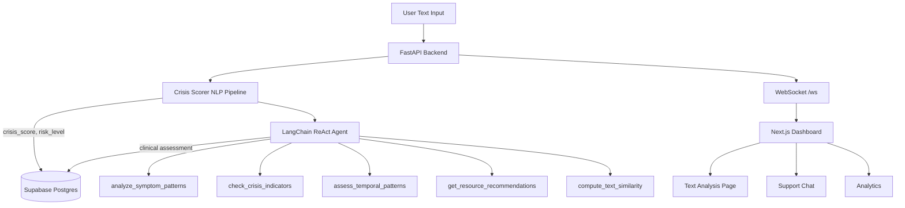

# MINDWATCH — Multi-Modal Mental Health Crisis Detection Engine

A research-grade AI platform that detects early signs of mental health crises from text using NLP,
semantic symptom analysis, and an autonomous LangChain ReAct agent powered by Groq LLM.

**The problem:** 80% of people with depression never receive a diagnosis. The average time from
first symptoms to treatment is 11 years. MINDWATCH addresses this gap with an explainable,
transparent AI screening system.

---

## Architecture



## Core AI Components

### 1. Crisis Scoring NLP Pipeline (`ml/crisis_scorer.py`)
- Embeds input text with `all-MiniLM-L6-v2` (HuggingFace, 384-dim)
- Computes semantic similarity against DSM-5 symptom anchors
- Scores 3 dimensions: depression, anxiety, acute crisis signal
- Detects dominant emotion from 8 clinical categories
- Returns composite crisis_score (0.0–1.0) in <100ms on CPU

### 2. LangChain ReAct Agent (`agent/agent.py`)
- Autonomous clinical investigation using Groq LLM (Llama 3, free tier)
- 5 structured tools grounded in real database queries
- Full reasoning trace persisted per-step to Supabase
- Retry logic with exponential backoff on API failures

### 3. Consumer Support Chat (`routers/consumer.py`)
- Real users describe their situation in plain English
- Groq LLM provides compassionate, clinically-informed responses
- Identifies situation type, risk level, immediate actions, and resources
- Keyword fallback when Groq is unavailable

---

## Tech Stack Justification

| Technology | Why chosen |
|---|---|
| `all-MiniLM-L6-v2` | 80MB, CPU-fast, free, state-of-art semantic similarity. No API key. |
| DSM-5 symptom anchors | Transparent, reproducible. No proprietary clinical dataset required. |
| Groq API | 300–800 tokens/sec, free tier, no GPU. Fastest free LLM available. |
| LangChain ReAct | Tool-grounded reasoning. Agent conclusions backed by real DB data. |
| FastAPI | Async-native, WebSocket support, auto OpenAPI docs. |
| Supabase | Zero local DB install. Free managed Postgres + Realtime. |
| Next.js 14 + Framer Motion | SSR dashboard, smooth animations, responsive. |

---

## Setup

### 1. Backend
```bash
cd backend
python3 -m venv venv && source venv/bin/activate
pip install -r requirements.txt
cp .env.example .env   # fill in GROQ_API_KEY, SUPABASE_URL, SUPABASE_ANON_KEY
```

### 2. Supabase Schema
Run `backend/supabase_schema.sql` in your Supabase SQL Editor.

### 3. Start Backend
```bash
cd backend
python3 -m uvicorn main:app --reload
# API: http://localhost:8000
# Docs: http://localhost:8000/docs
```

### 4. Frontend
```bash
cd frontend
cp .env.local.example .env.local   # fill in Supabase values
npm install
npm run dev
# Dashboard: http://localhost:3000
```

---

## Pages

| URL | Description |
|---|---|
| `localhost:3000` | Live dashboard — real-time assessment feed + risk alerts |
| `localhost:3000/analyze` | Submit text for clinical analysis |
| `localhost:3000/assessments/[id]` | Full clinical report + agent reasoning trace |
| `localhost:3000/chat` | Mental health support chatbot |
| `localhost:3000/analytics` | 7-day trends + emotion distribution |

---

## Environment Variables

| Variable | Description |
|---|---|
| `GROQ_API_KEY` | Free at console.groq.com |
| `SUPABASE_URL` | From Supabase Dashboard → Settings → API |
| `SUPABASE_ANON_KEY` | From Supabase Dashboard → Settings → API |
| `NEXT_PUBLIC_API_BASE_URL` | `http://localhost:8000` |
| `NEXT_PUBLIC_WS_URL` | `ws://localhost:8000/ws` |

---

## Disclaimer

MINDWATCH is a research and educational platform. It is NOT a substitute for professional
mental health care. If you or someone you know is in crisis, please contact:
- **988 Suicide & Crisis Lifeline**: call or text 988
- **Crisis Text Line**: text HOME to 741741
- **Emergency Services**: 911
